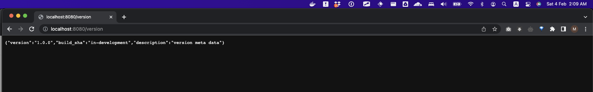

## How to run the application in local
- Assume that you have NodeJS and npm installed
- Once you are inside the folder in Terminal
  ```
  npm install
  npm start
  ```
- application should work over browser 
  - Home page - `http://localhost:8080/`
  - Version page - `http://localhost:8080/version`

  

   

  


## How to build the Docker Image locally to test
- Assume that you have Docker installed
- `docker build -t myapp:1.0 .`
- `docker run -p 8080:8080 myapp:1.0`
  
  
- You could change the version in package.json to test 
- You could provide build-arg variable to test build_sha
  - `docker build -t myapp:2.0 . --build-arg BUILD_SHA=123456789`
  - `docker run -p 8080:8080 myapp:2.0`
  
  
  


## Build Docker Image  and push to DockerHub over CI Pipeline (GitHub Action)
- version - will picked dynamically on Docker build from [package.json](./package.json) "version" 
- build_sha - will be passed dynamically on Docker build through BUILD_SHA via build-arg variable
- Used github Actions to build and push Docker Image [CI Pipeline](./.github/workflows/docker-image.yml)
- You may upload this code into your own github repo and the proceed further
  - ensure that setup these 2 secrets to build successfully
    - `DOCKERHUB_USERNAME` and `DOCKERHUB_PASSWORD`
- To test the CI
  - Update `version` in [package.json](./package.json)
  - Push the changes (as of now I left to build directly in main branch)
  - CI will trigger the CI and push the image to my [dockerHub](https://hub.docker.com/repository/docker/[muthukumarse]/myapp/general) 
  - get the last pushed image into local by
    - `docker pull [muthukumarse]/myapp:xxx`
    - `docker run -p 8080:8080 [muthukumarse]/myapp:xxx`
    - Goto Version page - `http://localhost:8080/version`
      - you should see the `version` which comes from [package.json](./package.json)
      - you should see build_sha which comes from last commit-sha from main branch
       
       
       
       
       
       
       

